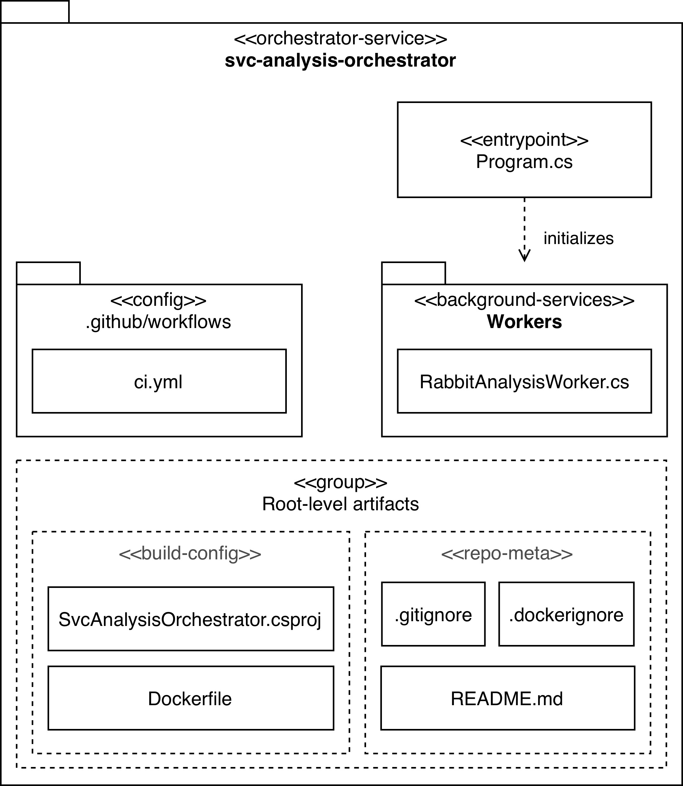
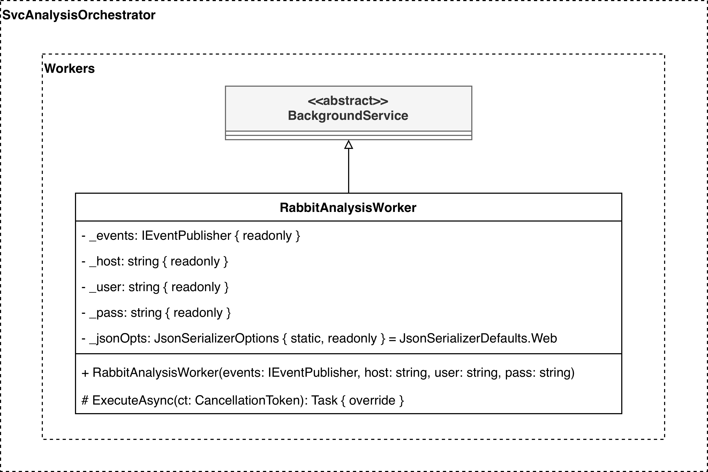

# SvcAnalysisOrchestrator
Microservice that orchestrates analysis. Consumes `RequestAnalysis` commands from RabbitMQ and publishes `analysis.started` and `analysis.completed` event exchanges.

---

## Codebase Architecture

---

## Design Class Diagram

---

See the [full system overview](https://github.com/team-2-devs/infra-core) in the **infra-core** repository.